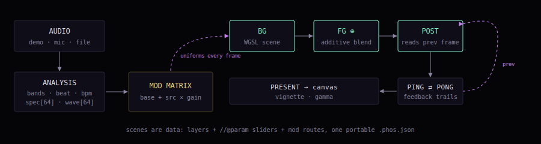

<p align="center">
  
</p>

<p align="center">
  
  
  
  
  
</p>

```
██████╗ ██╗  ██╗ ██████╗ ███████╗██████╗ ██╗  ██╗███████╗███╗   ██╗███████╗
██╔══██╗██║  ██║██╔═══██╗██╔════╝██╔══██╗██║  ██║██╔════╝████╗  ██║██╔════╝
██████╔╝███████║██║   ██║███████╗██████╔╝███████║█████╗  ██╔██╗ ██║█████╗
██╔═══╝ ██╔══██║██║   ██║╚════██║██╔═══╝ ██╔══██║██╔══╝  ██║╚██╗██║██╔══╝
██║     ██║  ██║╚██████╔╝███████║██║     ██║  ██║███████╗██║ ╚████║███████╗
╚═╝     ╚═╝  ╚═╝ ╚═════╝ ╚══════╝╚═╝     ╚═╝  ╚═╝╚══════╝╚═╝  ╚═══╝╚══════╝
```

**PHOSPHENE** is a WebGPU authoring environment for audio-reactive visualization —
a modern successor to the Plane9 / MilkDrop lineage. Scenes are layered
(background × foreground × post with real feedback), written in WGSL, driven by
live audio analysis, and saved as portable JSON.

A *phosphene* is the light you see with your eyes closed — light your visual
system synthesizes with no image coming in. That is what this does with sound.

<p align="center">
  <br>
  <sub>DEEP FIELD — the built-in nebula + spectrum-ring scene, rendered offline with the same fbm/palette math the WGSL runs live.</sub>
</p>

## Why

The 3D music-visualizer/screensaver niche froze around 2016: Plane9 stopped
shipping, MilkDrop's heirs maintain engines rather than products, and nothing
modern took their place. PHOSPHENE restarts the lineage on current standards:
WGSL instead of a dead proprietary shader format, scenes as open JSON instead
of an opaque database, real compiler diagnostics instead of guesswork, and AI
generation built in — because content volume is no longer the barrier it was.

## The pipeline

<p align="center">
  
</p>

Every frame: audio analysis (bands, flux beat detection, median BPM, 64-bin
log spectrum + waveform) feeds a **modulation matrix** that routes any feature
into any parameter — then three WGSL stages render through ping-pong feedback.
Layer combinations multiply: a handful of stages per slot yields hundreds of
distinct scenes.

## Authoring

A stage is one function:

```wgsl
//@param radius 0.1 0.45 0.26
fn render(c : Ctx) -> vec3f {
  let v = spec(i32((atan2(c.q.y, c.q.x) / 6.2831 + 0.5) * 64.0));
  let d = abs(length(c.q) - radius() - v * 0.2);
  return pal(0.45 + v * 0.5) * smoothstep(0.01, 0.0, d) * c.intensity;
}
```

- `Ctx` carries uv, aspect-corrected coords, time, bass/mid/treble/beat/energy.
- `//@param name min max default` materializes a slider — no UI code.
- POST stages get `srcTex(uv)`, `prevTex(uv)`, and `c.fb` for trails.
- Compile errors land in the editor gutter on the exact line, via
  `getCompilationInfo()` — real diagnostics from the real compiler.
- **✦ GENERATE WITH AI** turns a description into a stage; on compile failure
  the WGSL error is fed back for an automatic repair pass.
- GPU device loss (sleep/resume, driver reset, TDR) is a designed event:
  reinitialize, recompile, resume. The crash that killed the old tools is a
  log line here.

## Quick start (Windows)

```
npm install
npm run dev        # Vite dev server — open in Chrome or Edge (WebGPU)
```

| command | what |
|---|---|
| `npm run dev` | dev server with HMR |
| `npm test` | 22 tests: parser, packing, mod matrix, static WGSL validation of every shipped shader |
| `npm run build` | typecheck + bundle → `dist\index.html`, a single self-contained file |

The one-file `dist\index.html` is a **build target**, not the architecture —
copy it anywhere, double-click, it runs.

## Layout

```
src/
  core/     scene format v3 · //@param parser · uniform packing · mod matrix
  gpu/      WGSL assembly (Ctx contract, noise/palette lib) · WebGPU renderer
  audio/    demo synth / mic / file · bands, beat, BPM, spectrum, waveform
  shaders/  built-in WGSL library and templates
  ai/       generation with compile-error repair loop
  ui/       CodeMirror 6 editor · WGSL highlighting · lint gutter
tests/
assets/
```

## Roadmap

- [ ] Native shell (Tauri, same codebase): system-audio loopback, OS screensaver
- [ ] Multi-monitor output
- [ ] Scene sharing / community library

---

<p align="center"><sub>a <b>Stuff is Parts</b> project</sub></p>
