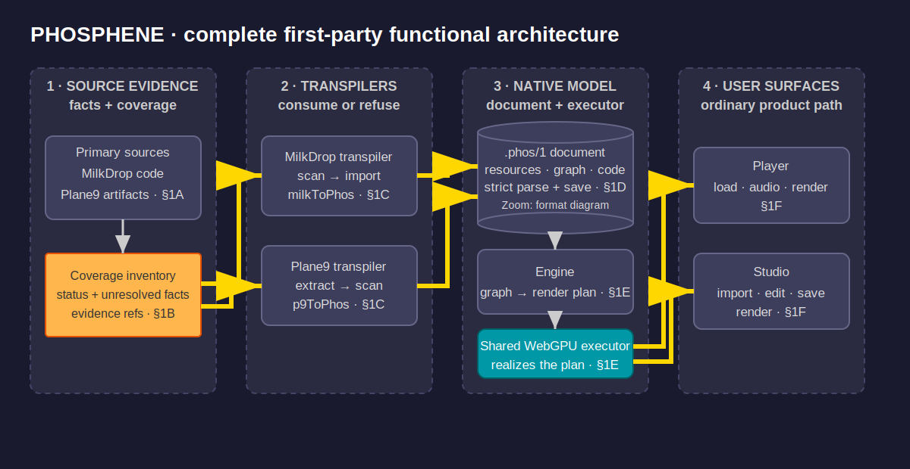

# PHOSPHENE Repository {#top}

---

### DOCUMENT ROLE

Layer 4 repository entry point. Circumstance: hydrate on PHOSPHENE before
planning, implementation, or review. Responsibility: maps the complete
PHOSPHENE architecture (§1), connects every permanent repository document to
that architecture (§2), and identifies the implementation artifacts that own
each function. The two repository guidelines named in §2A are hydration
subordinates; reference documents are opened only when their mapped function
is in scope.

---

### 1. PHOSPHENE ARCHITECTURE {#architecture}

#### I. WHAT

PHOSPHENE converts MilkDrop presets and Plane9 scenes into one durable,
editable native graph and executes that graph through one browser-native
runtime used by both product surfaces.

Source: [`phosphene-architecture.drawio`](phosphene-architecture.drawio).
The diagram is exhaustive for first-party runtime functions at this checkout;
third-party libraries, fixtures, generated scene data, stylesheets, and
mechanical configuration are supporting artifacts rather than independent
functional areas.

#### II. HOW

> **1A. Authoritative source evidence**
>
> MilkDrop behavior comes from its released source and format documentation,
> corroborated by projectM and Butterchurn where necessary. Plane9 behavior
> comes from authentic `.p9c` graphs, the installed binaries and shipped GLSL,
> official documentation, corpus structure, and targeted runtime observation
> in that order. `reference/sip-phosphene-source-locations-reference.md` maps
> the exact access paths; `guidelines/sip-phosphene-compatibility-guidelines.md`
> owns the authority and evidence rules.

> **1B. Inventories and source contracts**
>
> `reference/sip-phosphene-source-inventory-reference.md` accounts for the
> source-defined property surface and routes each row to implementation or a
> named refusal. MilkDrop topology, audio, EEL, render-state, and variable
> contracts have distinct references; Plane9's variant contract, primitive
> counts, and RenderToTexture format evidence do likewise. These documents
> locate and bound claims; primary evidence remains the semantic authority.

> **1C. Strict source transpilers**
>
> `phosphene-engine/src/milk-import.mjs` scans MilkDrop source records and
> `milkToPhos()` in `phosphene-engine/src/phos.mjs` consumes each record or
> refuses it. `phosphene-engine/src/p9-import.mjs` extracts and scans Plane9
> scene XML, applies node-variant `P9_COMPATIBILITY` dispositions, and emits
> accepted nodes and connections. It accepts root and metadata records but
> does not preserve their fields in `.phos`, so this path is not yet a
> complete Plane9 scene transcription. Both front ends target the same
> native document; neither invokes a source renderer.

> **1D. Native `.phos` document**
>
> `phosphene-engine/src/phos.mjs` owns strict parse, canonical serialization,
> runtime projection, and Studio write-back for `.phos/1`. A scene carries
> metadata, explicit resources, typed nodes and ports, typed edges, and
> expression programs. `reference/sip-phosphene-format-reference.md` owns the
> complete format contract and expands the Native Model node in the main
> diagram. `reference/sip-phosphene-scene-anatomy-reference.md` preserves why
> the accepted five-family graph model was derived from the sources.

> **1E. Native execution and WebGPU realization**
>
> `phosphene-engine/src/engine.mjs` validates resources and graph topology,
> evaluates per-frame expressions, executes registered value operations, and
> builds a resource-explicit render plan in graph order.
> `phosphene-engine/src/render-executor.mjs` is the single browser consumer of
> that plan and realizes supported passes with WebGPU. Supporting runtime
> modules are `expr-vm.mjs`, `eel.mjs`, `timekeeper.mjs`, `warp-mesh.mjs`,
> `render-wgsl.mjs`, and `src/audio/*`.

> **1F. Player and Studio**
>
> `phosphene-engine/index.html` and `player.html` load
> `phosphene-engine/src/player.mjs`; `phosphene-engine/studio.html` loads
> `phosphene-engine/src/studio.mjs`. Both construct the same `Engine` and
> shared render context. The player supplies scene playback and audio-source
> control. The Studio loads native and convertible source files, exposes the
> graph and equations, shows refusals, and saves `.phos`.
> `reference/sip-phosphene-product-reference.md` owns the source-derived
> feature surface; `reference/sip-phosphene-platform-coverage-reference.md`
> maps those features to candidate established APIs; and
> `reference/sip-phosphene-ui-reference.md` owns visual and interaction rules.

> **1G. Evidence and mechanical quality**
>
> `phosphene-engine/check.mjs` contains executable regressions and explicit
> compatibility dispositions. Its results establish only the claims directly
> exercised by their cited evidence; an aggregate PASS does not expand source
> compatibility. `npm run gate` runs syntax, type, lint, style, and dead-code
> tools. The gate establishes code well-formedness, not source fidelity.
> Review-specific historical risks live in
> `reference/sip-phosphene-failure-modes-reference.md`.

#### III. WHY

The source evidence, transpilers, native document, native executor, and product
surfaces form one accumulating path because the project is a technical
translation, not three parallel viewers. The transpilers make each evidenced
mapping once; the `.phos` graph preserves that mapping as editable data; the
single executor prevents imported behavior from escaping into foreign or
source-keyed runtimes. Keeping the product on the same path makes a successful
translation observable where users actually load, edit, save, and run scenes.

[Back to Top](#top)

---

### 2. REPOSITORY DOCUMENTATION {#documentation}

#### I. WHAT

PHOSPHENE uses one entry point, two always-read repository guidelines, and
task-specific reference depth.

| Layer 4 role | Artifact | Invocation |
|---|---|---|
| Entry point | `claude-phosphene-repo.md` | User requests PHOSPHENE hydration |
| Compatibility guideline | `guidelines/sip-phosphene-compatibility-guidelines.md` | Every PHOSPHENE hydration |
| Development guideline | `guidelines/sip-phosphene-development-guidelines.md` | Every PHOSPHENE hydration |
| Reference depth | `reference/sip-phosphene-*-reference.md` | Only when its mapped function is in scope |

#### II. HOW

> **2A. Hydration sequence**
>
> Read this entry point, then both repository guidelines. Open reference
> documents by circumstance:
>
> | Task circumstance | Required reference depth |
> |---|---|
> | Any source interpretation or compatibility claim | Source locations + source inventory + affected engine contract |
> | MilkDrop pipeline topology | MilkDrop primitive contract |
> | MilkDrop audio, expression, GPU state, or variables | Matching MilkDrop audio, EEL, render-state, or variable reference |
> | Plane9 node semantics or compatibility | Plane9 contract; add primitive inventory or RTT-format evidence only when implicated |
> | `.phos` schema, graph, resource, serialization, or runtime projection | Format reference; add scene-anatomy rationale only if representational adequacy is questioned |
> | Player, Studio, audio controls, or scene management | Product reference |
> | Platform/API choice for a product feature | Product + platform-coverage references |
> | Visual or interaction work | UI reference |
> | Source-port implementation or substantive review | Failure-modes reference plus every source reference needed by the claim |
>
> Repository status is reconstructed from the exact commit, executable code,
> retained evidence, authentic fixtures, refusal paths, and actual check
> results. Chat summaries, commit messages, and handoffs are inspection leads,
> not hydration substitutes.

> **2B. Complete reference map**
>
> | Reference | Unique responsibility |
> |---|---|
> | `reference/sip-phosphene-format-reference.md` | Exact native document and runtime projection contract |
> | `reference/sip-phosphene-scene-anatomy-reference.md` | Source derivation of the accepted primitive families and design seams |
> | `reference/sip-phosphene-source-inventory-reference.md` | Cross-engine property coverage accounting |
> | `reference/sip-phosphene-source-locations-reference.md` | Primary-artifact paths and pinned identities |
> | `reference/sip-phosphene-milkdrop-reference.md` | MilkDrop pipeline-to-primitive mapping |
> | `reference/sip-phosphene-milkdrop-audio-reference.md` | Source audio-processing contracts |
> | `reference/sip-phosphene-milkdrop-eel-reference.md` | MilkDrop EEL numerical semantics |
> | `reference/sip-phosphene-milkdrop-render-state-reference.md` | MilkDrop GPU-state perimeter |
> | `reference/sip-phosphene-milkdrop-variable-reference.md` | MilkDrop per-frame variable perimeter |
> | `reference/sip-phosphene-plane9-reference.md` | Plane9 scene-visible variant contracts and dispositions |
> | `reference/sip-phosphene-plane9-primitives-reference.md` | Plane9 full-corpus primitive counts |
> | `reference/sip-phosphene-plane9-rtt-format-reference.md` | Plane9 RTT format enum binary evidence |
> | `reference/sip-phosphene-product-reference.md` | Source-derived viewer and Studio capability inventory |
> | `reference/sip-phosphene-platform-coverage-reference.md` | Candidate established API/library/native mechanisms |
> | `reference/sip-phosphene-ui-reference.md` | Visual and interaction rules |
> | `reference/sip-phosphene-failure-modes-reference.md` | Witnessed failure history and falsification taxonomy |

> **2C. Documentation ownership**
>
> Each permanent claim has one owner:
>
> | Information domain | Owner |
> |---|---|
> | Goal, source authority, exactness, evidence, completion | Compatibility guideline |
> | Repository work loop, hydration, mechanical gate, review discipline | Development guideline |
> | Complete system architecture and document routing | This entry point |
> | Native scene schema and runtime projection | Format reference |
> | Cross-engine coverage accounting | Source-inventory reference |
> | Primary-source access paths and pinned revisions | Source-locations reference |
> | Engine-specific semantic evidence | MilkDrop or Plane9 reference |
> | Product capability surface | Product reference |
> | Chrome and interaction design | UI reference |
> | Witnessed development failure history | Failure-modes reference |
>
> Update the owning document with the implementation change that alters its
> claim. Do not create a roadmap, audit report, README, handoff, or parallel
> inventory to carry an already-owned permanent fact.

> **2D. Non-document repository structure**
>
> First-party runtime code lives under `phosphene-engine/src/`; browser entry
> pages and scenes live under `phosphene-engine/`; standard gate configuration
> lives at the repository root and `.github/workflows/`; authentic retained
> Plane9 fixture material and its provenance remain together under
> `sources/plane9/`. Vendored libraries remain under
> `phosphene-engine/vendor/` with their licenses and provenance.

#### III. WHY

The entry point carries the complete architecture so hydration does not depend
on discovering a collection of topical files. Guideline subordinates remain
small and universal enough to read every time; detailed evidence waits in
reference until a task needs it. Unique ownership prevents a status sentence,
inventory row, source contract, and implementation comment from becoming
competing authorities for the same fact.

[Back to Top](#top)
