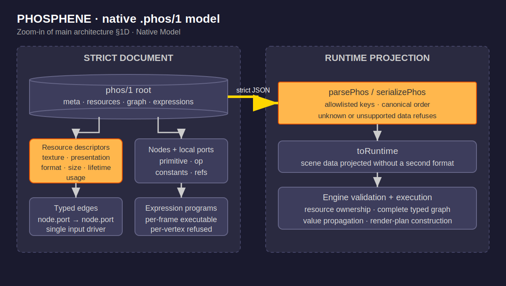

# PHOSPHENE Native Scene Format {#top}

---

### DOCUMENT ROLE

Layer 4 reference opened for `.phos` schema, serialization, graph, resource,
runtime-projection, or Studio write-back work. Responsibility: owns the exact
native `phos/1` document contract and its projection into the current engine.
It does not establish either source engine's compatibility status.

---

### 1. NATIVE FORMAT {#native-format}

#### I. WHAT

`.phos` is PHOSPHENE's strict, durable, source-neutral scene document: explicit
metadata, graphical resources, typed nodes and ports, typed edges, and staged
expression programs.



Source: [`phosphene-format.drawio`](phosphene-format.drawio). This is the
traceable zoom-in of the Native Model node in the repository architecture.

#### II. HOW

Structure derives from
`reference/sip-phosphene-scene-anatomy-reference.md`; policies below are tagged
[DERIVED] when forced by named source evidence or the compatibility guideline,
and [DESIGN] when chosen by PHOSPHENE. The implementation authority is
`phosphene-engine/src/phos.mjs`; the commented runnable example is
`phosphene-engine/scenes/TEMPLATE.phos`.

## Carrier

- **Strict JSON**, parsed with native `JSON.parse`. No parser dependency.
  [DESIGN — but constrained by the repo rule "standard tools only"]
- **Annotation keys**: any object key beginning `//` is authoring annotation,
  ignored and *stripped* by the loader (glTF/`$comment` pattern). Comments do
  not survive a studio save. [DESIGN]
- **Unknown keys refuse**: any non-`//` key the spec does not define is a parse
  error naming the key and path. A scene never half-loads. [DERIVED —
  compatibility-guideline refusal discipline; the external review flagged
  accept-unknown-silently as a defect in the expr VM]
- **Versioning**: `format` must equal `"phos/1"` exactly. On format change,
  migrate the scene files and bump — no multi-version load paths. [DESIGN —
  Current State Only; Plane9 precedent: FormatVersion]

## Top-level structure

```
{
  "format": "phos/1",
  "meta": {
    "name": string,                     // required
    "sourceEngine"?: string,
    "source"?: { "engine", "file", "sha256" },   // provenance of a ported scene
    "author"?, "description"?, "tags"?, "license"?, "credit"?
  },
  "resources": [ ResourceDescriptor ],  // graphical resources the scene declares
  "nodes":   [ Node ],
  "edges":   [ { "out": "nodeId.portId", "in": "nodeId.portId" } ],
  "expressions": [ { "id", "stage": "per-frame"|"per-vertex", "code": [string],
                     "comments"?: [string] } ]   // comment-only source lines, verbatim
}
```

At the current checkout, `name` and the three `meta.source` strings are
validated, but the parser does not validate the value types or domain of other
optional meta keys. The allowlist can carry Plane9 author, description, tags, and license
after an explicit mapping, but cannot yet represent all Plane9 root fields
(`Id`, `ParentId`, `WarmupTime`, `SceneType`, versions, and development
timestamps). This is a concrete source-representation gap, not permission for
`p9ToPhos()` to discard those fields.

`comments` retains comment-only equation lines from a ported source file as
data (not as strippable `//` annotations), so they survive parse→serialize
round-trips. [DERIVED — exactness: source content is never silently dropped]

**Converted-scene naming:** the converter prefixes the scene name and file
with its source engine — `md-` for MilkDrop, `p9-` for Plane9 when that
converter exists — so provenance shows in the filename as well as in
`meta.source`.

**Per-vertex stage:** `"per-vertex"` parses as a valid stage (the format is
ahead of the engine here by design), but BOTH execution entries refuse it
until the engine runs per-vertex programs: the MilkDrop importer refuses
`per_pixel_N`/`per_vertex_N` lines carrying code, and the Engine refuses any
runtime scene whose perVertex list is non-empty. Accepted-but-unexecuted code
is the structure-claimed-as-function failure mode.

**Graph-derived render topology (reviewer foundation 2026-07-18):** the engine
executes the .phos graph. Graph edges are the sole topology authority; there
is no separate sequence grammar authorizing particular op neighbors. Render
completeness is a pure dataflow rule: every declared render output has an
outgoing edge, every declared render input has an incoming edge, and exactly
one presentation sink (a render op declaring a `presented: render` output)
exists. A structurally valid graph executes subject to each registered
operation's declared value constraints and render-plan input requirements: a
port constraint refuses an out-of-witness value on any write path, and a
render op that requires a specific incoming pass shape (borders requires an
in-flight warp-feedback pass) refuses at contribute time. Any graph violating
either the structural rules or an op's declared contract refuses with a
message naming the specific failure.

`meta.source` is the transpiler map made durable: every ported .phos names the
recipe file it was transcribed from, hash-pinned. [DERIVED — goal-doc Validation
Rule: expected values identify provenance]

**Explicit graphical resources (reviewer 2026-07-18 substrate spec).** The
`resources` array declares the graphical resources the scene needs. Each
`ResourceDescriptor` has strict allowlisted fields:

```
{
  "id": string,                                   // unique per scene
  "kind": "texture" | "presentation",
  "format": "rgba8unorm" | "rgba16float" | "preferred-canvas",
  "size": { "policy": "canvas-16block" | "canvas" }
        | { "policy": "fixed", "width": positive-integer,
                               "height": positive-integer },
  "lifetime": "persistent-pingpong" | "transient" | "per-frame",
  "usage": ["sampled" | "render-attachment" | "presentation", ...]
}
```

Unknown fields, kinds, formats, policies, lifetimes, and usage values
parse-refuse. Every `texture`-typed port whose value references a
`resourceId` must name an id declared in this list, and the engine
refuses at construction otherwise. The render plan the engine emits
carries a copy of the scene's resources, per-pass `reads` and `writes`
arrays naming resource ids, and a `presentation` field naming exactly
one resource the executor blits to the canvas.

Any presence of `timeline` refuses until its semantics are implemented.
[DERIVED — refusal over unimplemented acceptance]

## Node and Port

```
Node { "id": string (unique), "primitive": "graph"|"shader"|"expr"|"geom"|"compute",
       "op": string, "ports": { portId: Port } }
Port { "type": "float"|"vec2"|"vec3"|"vec4"|"color"|"texture"|"mesh"|"effect"|"render",
       "value"?: number | number[2] | number[3] | number[4]
               | { "resourceId": string } }
       // constant value permitted for float (number),
       // vec2/vec3/vec4 (array of matching length);
       // texture constants are resource references; other port types cannot
       // carry constants in phos/1
```

Port names are the exact source-format keys — `fDecay`, `ib_r` — zero renaming.
[DERIVED — exactness standard: parsed fields preserved]

Ports are **node-local**: each port is addressed as `nodeId.portName`, and the
same port name (`Color`, `Render`, `Value`) may appear on multiple nodes without
collision at the graph level. Edges are typed and node-qualified, resolving to
an existing `nodeId.portName` on both ends with matching port types. [DERIVED —
.p9c Out/In model]

**EEL exception.** The per-frame EEL surface uses a flat variable-name view of
float ports so MilkDrop-style equations resolve names without node
qualification. When per-frame code exists, two float ports across different
nodes that would resolve to the same EEL name cause Engine construction to
refuse — the flat view cannot determine which port owns the write. Scenes
with no per-frame code are unaffected. [DERIVED — MilkDrop equation
compatibility]

Value edges propagate scalar and vector values along the source→destination
direction; render edges propagate port-qualified `RenderPlan` values the same
way, with each render port carrying its own plan. At fan-out the executor
deep-clones the propagated plan per consumer, so two downstream branches of
the same producer port cannot share mutable state. [DERIVED — reviewer
foundation 2026-07-18]

Each input port accepts one driver at a time. An input carrying both a
constant `value` and an incoming edge refuses at construction (the edge would
silently overwrite the constant), and a second edge into the same input port
also refuses. Every required input must be sourced by either a constant or an
edge. [DERIVED — dataflow unambiguity]

An op may declare `portConstraints` naming the exact witnessed value each such
port must carry. Construction, `setVar()` live edits, value-edge propagation
each frame, and the per-frame EEL pool sync all funnel through one hook that
enforces the constraint, so no write path can leave a witnessed-value port
holding a value the op has no implementation for.

## Scene-one mapping (101-per_frame.milk → nodes)

| .milk key | node | why (source citation) |
|---|---|---|
| fDecay | warp | decay applies in the warped blit / feedback (milkdropfs.cpp:1096, PRIMITIVES row 5) |
| zoom, rot, warp | warp | warp mesh distortion params (milkdropfs.cpp:1877-1898, row 3) |
| ob_size ob_r ob_g ob_b ob_a, ib_size ib_r ib_g ib_b ib_a | borders | border draw in the sprites region (milkdropfs.cpp:3460, rows 14 span 3383-3515); drawn before composite per the pipeline grammar (milkdropfs.cpp:1048-1214) |
| per_frame_N | expressions[] | per-frame equations (milkdropfs.cpp:471+, row 1) |

Canonical wiring for the MilkDrop import: `warp.out → borders.in`,
`borders.out → comp.in` (render-type ports). The engine derives ordering by
topological sort of the typed edges and evaluates each op in that order:
value ops read inputs, compute outputs, and propagate them along outgoing
value edges; render ops receive incoming plans keyed by input port, return
outgoing plans keyed by output port, and the executor clones each returned
plan per outgoing edge. The presentation sink's `presented` output is the
frame's render plan for that step. Nothing about the MilkDrop shape is
privileged: any structurally valid graph executes subject to each op's
declared contract (port constraints, incoming pass shape). The .phos file is
the durable scene; the runtime IR conforms to it, not the reverse.

The converter (`milkToPhos`) throws on any .milk key not in this table —
completeness by refusal, no silent drops. [DERIVED — "nothing may be flattened
or silently omitted"]

**Native operations vs source compatibility.** The NATIVE_OPS registry
(`phosphene-engine/src/engine.mjs`) declares which operations the engine can
execute. Source-engine compatibility is a separate gate: the importer
(`phosphene-engine/src/p9-import.mjs` for Plane9) carries its own
`P9_COMPATIBILITY` table classifying each source node type as PASS or
UNRESOLVED, and refuses to convert any source scene whose nodes carry an
UNRESOLVED status regardless of whether the corresponding native op exists.
Native-op availability does not authorize source conversion; the compatibility
gate requires evidence-backed source semantics.

## Semantics: how source behavior enters a scene

Per the conversion rule and the compatibility guideline's no-parallel-runtimes
requirement, the native substrate exposes platform primitives (raw
frame dt, raw audio samples via the pcm-tap worklet, WebGPU), and source-engine
behaviors exist as explicit, source-cited components expressed in that
substrate — milkdrop-time (pluginshell.cpp DoTime), milkdrop-loudness (the
PCM/Loudness chain), and Plane9 equivalents as their audits complete. A
converted scene carries or references the components its behavior depends on;
a hand-authored scene uses native primitives directly or pulls the same
components by choice. There is no ambient per-engine mode.

**Interim time and audio ownership (stated, not hidden).** The graph
executes, but two source-specific behaviors are still delivered globally
rather than through explicit graph components:

- The Engine owns and injects MilkDrop time. `src/timekeeper.mjs`
  (from `pluginshell.cpp:1895+`) computes the damped `time`/`fps` values
  inside the Engine each step and writes them into the flat EEL pool, so
  every scene sees MilkDrop's damped clock in its per-frame expressions
  regardless of source engine.
- The product front ends (`src/player.mjs`, `src/studio.mjs`) currently
  compute MilkDrop loudness values via `AudioEngine.analysis` (backed by
  `src/audio/analysis.mjs`) and pass them into `Engine.step()`. The Engine
  then injects those supplied `bass`/`mid`/`treb`/`_att` values globally
  into the same EEL pool, so per-frame equations read them by name.

This is an interim ownership problem: source-specific timing and audio
behavior must eventually be represented as explicit graph components a scene
references, so the semantics travel with the scene rather than with the
engine or the front end. No currently accepted Plane9 conversion consumes Plane9 time or
audio: the accepted `Clear → Screen` slice is time-invariant, Color Cycle
refuses at the compatibility gate (HSLAToColor UNRESOLVED), and Beat's
detector remains unresolved so `musicActive=false` is supplied in product.

**Timing delta note.** The native MinMax op advances using the raw `dt`
argument passed to `Engine.step()`, not MilkDrop's damped `Timekeeper.time`.
Before Plane9 MinMax conversion can be accepted, the project must establish
the exact meaning and lifecycle of Plane9's evaluator/frame delta from
`Plane9Engine.dll` and represent the appropriate timing dependency
explicitly as a graph component — the current use of `dt` is a native-scene
implementation choice, not evidence about Plane9 MinMax timing.

## What loading guarantees, and what it does not

Parsing validates structure and refuses unknowns. Engine construction adds
the graph-completeness rules above (typed edges resolve, every required input
sourced, every render output consumed, exactly one presentation sink) and the
port-constraint check on every write path. None of that proves the scene
renders correctly. The `phosphene-engine/check.mjs` script executes the
native graph and verifies the produced render plans' structure and values;
`src/render-executor.mjs` — the shared browser render-plan executor consumed
by both `src/player.mjs` and `src/studio.mjs` — turns those plans into
WebGPU commands at run time. The automated checks do not execute those
WebGPU commands against a real GPU. Visual quality and Studio layout remain
human-viewed product judgments. Source compatibility is a
different standard: it requires external, inspectable semantic evidence
against the source engine's own behavior — visible rendering, screenshot
similarity, and successful execution are not evidence of source
compatibility. Human viewing applies where no external reference exists, and
even then it does not certify source compatibility.

#### III. WHY

One strict native document makes the transpiler result inspectable, editable,
canonical, and portable while keeping source compatibility separate from
native representational capability. Refusal on unknown or unimplemented data
prevents a successful load from hiding lost source behavior.

[Back to Top](#top)
